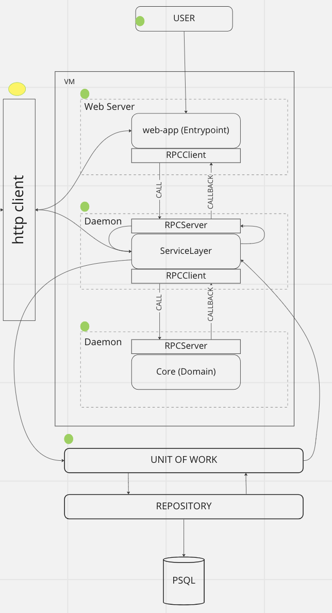

OnBoarding
----------

Прежде чем начать работу над *openvair*, мы рекомендуем 
ознакомиться с материалом по *Domain Driven Design (DDD)*, который
мы использовали при разработке.

### Книги
* "Domain-Driven Design: Tackling Complexity in the Heart 
of Software" Эрика Эванса - классический ресурс, который 
представляет общие принципы *DDD*.
* "Паттерны разработки на Python: TDD, DDD и 
событийно-ориентированная архитектура." Гарри Персиваля и 
Боба Грегори - отличный материал, который представляет
примеры паттернов реализованных на python.

### Технологии
* [RabbitMQ](https://www.rabbitmq.com/tutorials/tutorial-one-python.html) - очереди сообщений.
* [PostgreSQL](https://www.postgresql.org/docs/current/) - база данных.
* [FastAPI](https://fastapi.tiangolo.com/) - фреймворк веб приложения.

### Паттерны
* [RPC](https://www.rabbitmq.com/tutorials/tutorial-six-python.html) - способ 
общения между разными уровнями модуля.
* [AbstractFactory](https://habr.com/ru/post/465835/) - используется
для унифицированного выбора домена.
* [Repository](https://learn.microsoft.com/ru-ru/aspnet/mvc/overview/older-versions/getting-started-with-ef-5-using-mvc-4/implementing-the-repository-and-unit-of-work-patterns-in-an-asp-net-mvc-application)
* [UnitOfWork](https://learn.microsoft.com/ru-ru/aspnet/mvc/overview/older-versions/getting-started-with-ef-5-using-mvc-4/implementing-the-repository-and-unit-of-work-patterns-in-an-asp-net-mvc-application)

### Библиотеки
* [Toml](https://toml.io/en/)
* [Alembic](https://alembic.sqlalchemy.org/en/latest/)
* [Requests](https://requests.readthedocs.io/en/latest/)
* [Pydantic](https://docs.pydantic.dev/)

### Структура модуля
- adapters - реализация работы с базой данных.
  - orm.py - реализация таблиц модуля в
    [императивном стиле](https://docs.sqlalchemy.org/en/20/orm/mapping_styles.html#imperative-mapping).
  - repository.py - абстракция хранения данных.
  - serializer.py - сериализатор данных из одного слоя в другой.
- domain - реализация работы с системой в той или иной области.
  - base.py - базовая модель работы домена.
  - manager.py - запуск rpc сервера для прослушивания задач.
  - model.py - реализация абстрактной фабрики, которая выбирает
    какой домен будет выполнять задачу, в зависимости от
    пришедшей задачи.
- entrypoints - реализация интерфейса модуля.
  - api.py - fastapi router в котором реализованы
    обработчики запросов.
  - crud.py - реализация класса общения между слоями, который
    вызывает rpc запросы и ожидает ответа.
  - schemas.py - pydantic модели для валидации данных.
- service layer - слой в котором реализована бизнес логика.
  - manager.py - запуск rpc сервера для прослушивания задач.
  - service_layer.py - реализация бизнес логики.
  - unit_of_work.py - абстракция идеи атомарных операций.
- config.py - конфигурация и константы необходимые в работе модуля.
- <имя_модуля>-service-layer.service - демон для запуска сервисного слоя.
- <имя_модуля>-domain.service - демон для запуска доменного слоя.

### Архитектура работы модуля

### Таблица, что реализовано в проекте
##### Модуль Storage
| Функционал |  NFS   | LocalFS |
|:-----------|:------:|--------:|
| Создание   |   ✓    |       ✓ |
| Удаление   |   ✓    |       ✓ |
| Мониторинг |   ✓    |       ✓ |

##### Модуль Volume
| Функционал |  NFS   | LocalFS |
|:-----------|:------:|--------:|
| Создание   |   ✓    |       ✓ |
| Удаление   |   ✓    |       ✓ |
| Расширить  |   ✓    |       ✓ |
| Изменить   |   ✓    |       ✓ |
| Мониторинг |   ✓    |       ✓ |

##### Модуль Image
| Функционал |  NFS   | LocalFS |
|:-----------|:------:|--------:|
| Создание   |   ✓    |       ✓ |
| Удаление   |   ✓    |       ✓ |
| Изменить   |   ✓    |       ✓ |
| Мониторинг |   ✓    |       ✓ |

##### Модуль Virtual Machines
| Функционал     | Libvirt |
|:---------------|--------:|
| Создание       |       ✓ |
| Удаление       |       ✓ |
| Редактирование |       ✓ |
| Запуск         |       ✓ |
| Остановка      |       ✓ |
| Мониторинг     |       ✓ |

### [Как внести свой вклад в проект](CONTRIBUTING.md)

### Скоро здесь будет документация API

### Терминология

- Repository (Хранилище) - это механизм для сохранения и 
извлечения сущностей из базы данных или другого хранилища. 
Репозиторий обеспечивает инкапсуляцию доступа к данным и скрывает
детали хранения данных от других компонентов системы.

- Service (Сервис) - это объект, который выполняет операции в 
предметной области, которые не могут быть выполнены с помощью 
сущностей или значений. Сервисы используются для моделирования
бизнес-процессов или для выполнения действий, которые не 
относятся к определенной сущности.
