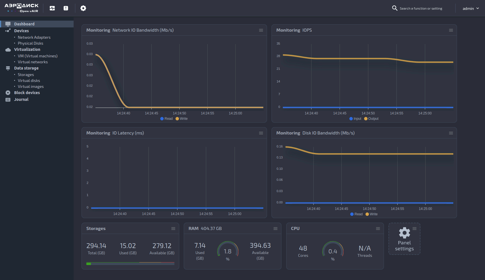

# Open vAir

## Translations

- [Русский](README.ru.md)

## Contents

1. [Preparation for Project Installation](#preparation-for-project-installation)
2. [Project Configuration](#project-configuration)
3. [Application Tunneling](#application-tunneling)
4. [Starting the Installation](#starting-the-installation)
5. [Uninstallation](#uninstallation)
6. [Documentation](#documentation)
7. [Daemons](#daemons)
8. [Links](#documentation-links)
9. [Contribution](#contribution)


## Project Description

**Open vAir** is a lightweight solution based on the **vAir** project,
designed for use as a development environment and virtualization system. The
program operates in interactive mode, providing a flexible and convenient
tool for managing virtual infrastructure.




---

<h3 align="left">Technologies:</h3>
<p align="left"> <a href="https://www.docker.com/" target="_blank" rel="noreferrer">  </a> <a href="https://www.linux.org/" target="_blank" rel="noreferrer">  </a> <a href="https://www.postgresql.org" target="_blank" rel="noreferrer">  </a> <a href="https://www.python.org" target="_blank" rel="noreferrer">  </a> <a href="https://www.rabbitmq.com" target="_blank" rel="noreferrer">  </a> <a href="https://fastapi.tiangolo.com/" target="_blank" rel="noreferrer"> </a><a href="https://www.qemu.org/" target="_blank" rel="noreferrer">  </a></p>

---

## Installation

To install **Open vAir** on a clean Linux system, follow these steps. It is
recommended to use **Ubuntu 20.04**, which is the most tested version.
**Ubuntu 22.04** is also supported.

### Preparation for Project Installation

1. Ensure all system packages are up to date. Execute the following commands:

    ```shell
    sudo apt update && sudo apt upgrade -y
    ```
    > **Important**: Don't forget to restart the system after executing these
    commands to apply all changes.

2. Execute the following commands to create and configure a user:

    1. Create a user:

        ```shell
        sudo useradd -s /bin/bash -d /opt/aero -m aero
        ```

    2. Assign necessary permissions:

        ```shell
        sudo chmod +x /opt/aero
        ```

    3. Add the user to the superuser list:

        ```shell
        echo "aero ALL=(ALL) NOPASSWD: ALL" | sudo tee /etc/sudoers.d/aero
        ```

    4. Switch to the new user:

        ```shell
        sudo -u aero -i
        ```

3. Download the project repository:

    ```shell
    git clone https://github.com/Aerodisk/openvair.git
    ```

4. Configure the configuration file:

    ```shell
    vi ~/openvair/project_config.toml
    ```

### Project Configuration

Before installing **Open vAir**, you need to set the login and password in
the `/opt/aero/openvair/project_config.toml` file. This data is required for
system authorization and access to all application functions.

Configuration example:

```toml
[default_user]
login = ''
password = ''
```

Note: The login and password fields must be filled in by the user. Otherwise,
the installation will be aborted.

### Application Tunneling
If the application needs to be run on a separate host as a server, configure
tunneling to the virtual network. Determine the local IP address of the host
by executing the command:

```bash
ip a
```

Specify the obtained IP address in the configuration file:

```toml
[web_app]
host = '192.168.1.2'
port = 8000
```

### Starting the Installation
1. Run the installation script:
```bash
./openvair/install.sh
```

Upon completion of the installation, you will receive a message with the
current application address, login, and password for working with the system.

### Uninstallation
To remove Open vAir, run the uninstallation script:
```bash
./openvair/uninstall.sh
```

### Documentation
Documentation can be found in the `/docs/build/index.html` file, which will be
created after the project installation. Documentation is also available at
the `/docs/` endpoint after installation is complete.

### Daemons

##### *web-app* Daemon
The web-app daemon ensures automatic startup and restart of the main FastAPI
based application, which is responsible for API and GUI operations. The
application is accessible at the address specified in the web_app section of
the config.toml file. By default, this is  `http://127.0.0.1:8000`.

* Check daemon status:
```bash
sudo systemctl status web-app.service
```
* Restart daemon:
```bash
sudo systemctl restart web-app.service
```
* Stop daemon:
```bash
sudo systemctl stop web-app.service
```
* View daemon logs:
```bash
sudo journalctl -fu web-app.service
```

##### *service-layer* Daemon
Service-layer daemons perform remote function calls of the service layer.
Each module has its own service-layer daemon. To check the status and view
logs, use similar commands, changing the service name to
`<module_name>-service-layer.service`.

For example:
```bash
sudo systemctl status storage-service-layer.service
```

##### *domain* Daemon
Domain daemons perform remote function calls of the domain layer. Each
module has its own domain daemon. To check the status and view logs, use
similar commands, changing the service name to
`<module_name>-domain.service`.
```bash
sudo systemctl status storage-domain.service
```

### Documentation Links
* Project introduction: [on-boarding](ONBOARDING.md).
* How to contribute to the project:  [howto-contribute](CONTRIBUTING.md).
* Code of conduct: [code-of-conduct](CODE_OF_CONDUCT.md).
* Code convention: [code-convention](CODE_CONVENTION.md).

### Frontend of the project
* To work with the user interface (Frontend), use the repository [Open vAir UI](https://github.com/Aerodisk/Open-vAIR-UI).

### Documentation of the project
* To work with the documentation, use the repository [Open vAIR docs](https://github.com/Aerodisk/openvair-docs).

---

### Statistics (including documentation and frontend projects)
<p></p> <p>&nbsp;</p>

---

### Contribution
Instructions for contributing to the project:

1. Fork the repository
2. Create a new branch (git checkout -b feature/your-feature)
3. Make changes and commit (git commit -m 'Added new feature')
4. Push changes (git push origin feature/your-feature)
5. Create a Pull Request
