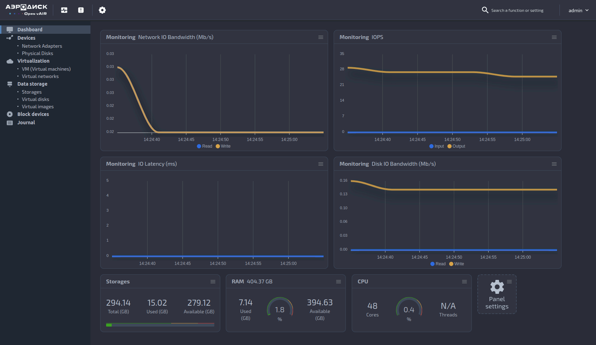

# Open vAir



## Переводы

- [English](README.md)

## Описание проекта

**Open vAir** — это облегченное решение на основе проекта **vAir**,
предназначенное для использования в качестве среды разработки и системы
виртуализации. Программа функционирует в интерактивном режиме, предоставляя
гибкий и удобный инструмент для управления виртуальной инфраструктурой.

## Установка

Для установки **Open vAir** на чистую систему с операционной системой Linux выполните следующие действия. Рекомендуется использовать **Ubuntu 20.04**, которая наиболее протестирована. Также поддерживается **Ubuntu 22.04**.

### Подготовка к установке проекта

1. Убедитесь, что все системные пакеты обновлены. Для этого выполните следующие команды:

    ```shell
    sudo apt update && sudo apt upgrade -y
    ```
    > **Важно**: Не забудьте перезагрузить систему после выполнения команд для применения всех изменений.

2. Выполните следующие команды для создания и настройки пользователя:

    1. Создайте пользователя:

        ```shell
        sudo useradd -s /bin/bash -d /opt/aero -m aero
        ```

    2. Назначьте необходимые права:

        ```shell
        sudo chmod +x /opt/aero
        ```

    3. Добавьте пользователя в список суперпользователей:

        ```shell
        echo "aero ALL=(ALL) NOPASSWD: ALL" | sudo tee /etc/sudoers.d/aero
        ```

    4. Переключитесь на нового пользователя:

        ```shell
        sudo -u aero -i
        ```

3. Скачайте репозиторий проекта:

    ```shell  
    git clone https://github.com/Aerodisk/openvair.git
    ```

4. Настройте конфигурационный файл:

    ```shell
    vi ~/openvair/project_config.toml
    ```

### Настройка проекта

Перед установкой **Open vAir** необходимо задать логин и пароль в файле  
`/opt/aero/openvair/project_config.toml`. Эти данные требуются для авторизации в
системе и доступа ко всем функциям приложения.

Пример конфигурации:

```toml
[default_user]
login = ''
password = ''
```

Примечание: Поля логина и пароля обязательно должны быть заполнены
пользователем. В противном случае установка будет прервана.

###### Туннелирование приложения
Если приложение необходимо запускать на отдельном хосте в качестве сервера,
настройте туннелирование в виртуальную сеть. Определите локальный IP-адрес
хоста, выполнив команду:

```bash
ip a
```

Укажите полученный IP-адрес в конфигурационном файле:

```toml
[web_app]
host = '192.168.1.2'
port = 8000
```

### Запуск установки
1. Запустите скрипт установки:
```bash
./openvair/install.sh
```

По завершении установки вы получите сообщение с текущим адресом приложения, логином и паролем для работы с системой.

### Деинсталляция
Для удаления Open vAir выполните скрипт деинсталляции:
```bash
./openvair/uninstall.sh
```

### Документация
Документацию можно найти в файле `/docs/build/index.html`, который будет создан
после установки проекта. Также документация доступна по эндпоинту `/docs/`
после завершения установки.

### Демоны

##### Демон приложения *web-app*
Демон web-app обеспечивает автоматический запуск и перезапуск основного
приложения на базе FastAPI, которое отвечает за работу API и GUI. Доступ к
приложению осуществляется по адресу, указанному в секции web_app файла
configtoml. По умолчанию это `http://127.0.0.1:8000`.

* Проверка состояния демона:
```bash
sudo systemctl status web-app.service
```
* Перезапуск демона:
```bash
sudo systemctl restart web-app.service
```
* Остановка демона:
```bash
sudo systemctl stop web-app.service
```
* Просмотр логов демона:
```bash
sudo journalctl -fu web-app.service
```

##### Демон *service-layer*
Демоны service-layer выполняют удаленные вызовы функций сервисного слоя.
Каждый модуль имеет свой собственный демон service-layer. Для проверки
статуса и просмотра логов используйте аналогичные команды, изменив название
сервиса на `<module>-service-layer.service`.

Например:
```bash
sudo systemctl status storage-service-layer.service
```

##### Демон *domain*
Демоны domain выполняют удаленные вызовы функций слоя доменной области. Для
каждого модуля существует свой демон domain. Для проверки статуса и просмотра
логов используйте аналогичные команды, изменив название сервиса на
*<имя_предметной_области>-domain.service*.
```bash
sudo systemctl status storage-domain.service
```

### Ссылки на документацию
* Ознакомление с проектом: [on-boarding](ONBOARDING.md).
* Как внести вклад в проект: [howto-contribute](CONTRIBUTING.md).
* Кодекс поведения: [code-of-conduct](CODE_OF_CONDUCT.md).
* Соглашение о коде: [code-convention](CODE_CONVENTION.md).

### Frontend проекта
* Для работы с интерфейсом пользователя (Frontend) используйте репозиторий [Open vAir UI](https://github.com/Aerodisk/Open-vAIR-UI).

### Документация проекта
* Для работы с документацией проекта используйте репозиторий [Open vAIR docs](https://github.com/Aerodisk/openvair-docs).
